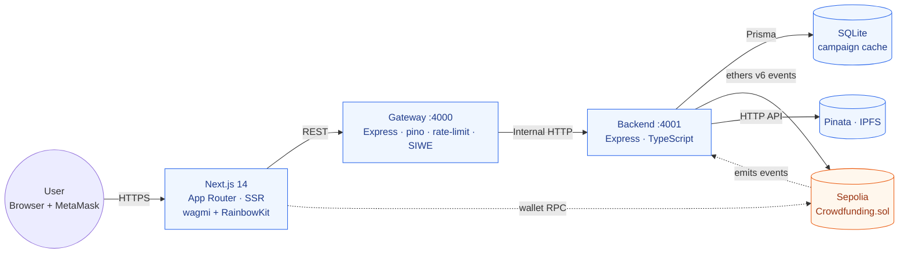

# Architecture

## System overview

The contract is the source of truth. The backend mirrors on-chain state into SQLite via an event indexer so the frontend can render lists and detail pages from a fast cache (server-side, with `revalidate: 5`). Writes always go through the user's wallet directly to the contract — the backend never holds a private key.

## Why a separate API gateway?

A separate gateway service lets us keep the backend focused on business logic and the database, while cross-cutting concerns — request logging, rate limiting, CORS, and SIWE-based authentication for the upload endpoint — live in one place. This mirrors the API Gateway pattern taught in week 4.

## Why SSR?

Campaign list and detail pages are rendered server-side via Next.js App Router (`force-dynamic`, fetched through the gateway). This satisfies the JAM stack + SSR topic from week 6 and gives the frontend a fast first paint without exposing the backend directly to the public internet.

## Eventual consistency

The indexer is an instance of the read-side projection pattern: events emitted on chain are streamed into a local SQLite cache, eventually consistent with the chain. If the backend is restarted, it resumes from a stored cursor (`IndexerCursor.lastBlock`) and replays missed events.
