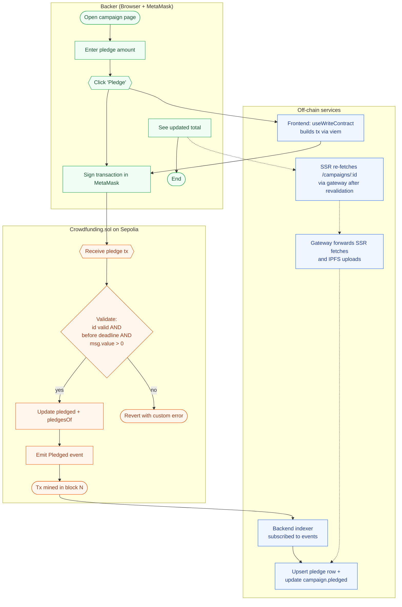

# BPMN — Pledge flow

The diagram below captures the end-to-end "Pledge ETH on a campaign" workflow across the three actors of the system: the **Backer** (wallet user), the **Frontend + Gateway + Backend** (off-chain hybrid services), and the **Crowdfunding contract** on Sepolia. It is rendered as a Mermaid flowchart as a textual approximation of BPMN; for the final coursework report, it is also redrawn as a proper BPMN 2.0 collaboration diagram in Visual Paradigm and exported to `docs/bpmn-pledge-flow.png`.

## Notes

- The wallet (MetaMask) signs and broadcasts the transaction directly to the chain — neither the gateway nor the backend ever sees the user's private key.
- The contract enforces invariants synchronously: invalid pledges revert with a custom error and never advance state.
- The backend indexer is **out-of-band** with the user's transaction. The user sees the on-chain confirmation immediately via wagmi's `useWaitForTransactionReceipt`; the SSR cache catches up within seconds via the indexer + Next.js `revalidate: 5`.
- Refund and Claim flows are structurally similar — only the contract guard conditions differ (deadline reached + goal met for Claim; deadline reached + goal not met for Refund).
